这篇文章用来记录操作系统课程的一次实验，在这次实验的过程中收获很多，自己也很有成就感，所以就把做实验的过程上传来记录一下自己的学习过程

<!--more-->

## 二、创建内核模块

编译内核模块simple.ko


加载与卸载内核模块

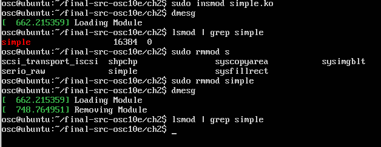

## 三、内核数据结构


当我第一次写完kstruct.c文件的kstruct_init()时运行出现了下面的问题：

我把simple.c复制到在ch2新建的kevin文件夹中运行make命令失败，之后把ch2中的Makefile也复制到Kevin中，还是失败，最后修改了Makefile中对应的名字。

Make之后又出现了下面的错误


添加slab.h去除for循环后可以make


由于在操作过程系统崩溃，我又换到了自己安装的虚拟机

在新系统中Kevin文件中的名称为simple.c

照着书本上的代码，调试一些bug后，可以完成一个结构体的实验。

```c
#include <linux/init.h>
#include <linux/module.h>
#include <linux/kernel.h>
#include <linux/slab.h>
#include <linux/types.h>
#include <linux/list.h>

struct birthday{
int day;
int month;
int year;
struct list_head list;
};

static LIST_HEAD(birthday_list);
/* This function is called when the module is loaded. */
int simple_init(void)
{
	printk(KERN_INFO "Loading Module\n");
	struct birthday *person;
	person=kmalloc(sizeof(person),GFP_KERNEL);
	printk(KERN_INFO "creating struct\n");
	person->day=2;
	person->month=8;
	person->year=1995;
	printk(KERN_INFO "creat successfully!\n");
	INIT_LIST_HEAD(&person->list);
	list_add_tail(&person->list,&birthday_list);
	struct birthday *ptr;
	printk(KERN_INFO "check link list\n");
	list_for_each_entry(ptr,&birthday_list,list)
    {
		printk(KERN_INFO "Birthday:%d-%d-%d\n",ptr->year,ptr->month,ptr->day);
    }
	printk(KERN_INFO "check ending\n");
	return 0;
}

/* This function is called when the module is removed. */
void simple_exit(void) {
	struct birthday *ptr,*next;
	list_for_each_entry_safe(ptr,next,&birthday_list,list)
    {
		list_del(&ptr->list);
	}
	printk(KERN_INFO "Removing Module\\n");
}

/* Macros for registering module entry and exit points. */
module_init( simple_init );
module_exit( simple_exit );
MODULE_LICENSE("GPL");
MODULE_DESCRIPTION("Simple Module");
MODULE_AUTHOR("SGG");
```


之后又主要改进了下面几个部分

这里我使用了一个结构体指针的数组，数组中每个元素都是一个结构体实例的指针，然后对每个指针开辟空间，再赋值，然后再连接到birthday_list头指针上。

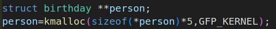


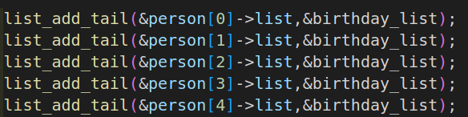

最后结果如下：


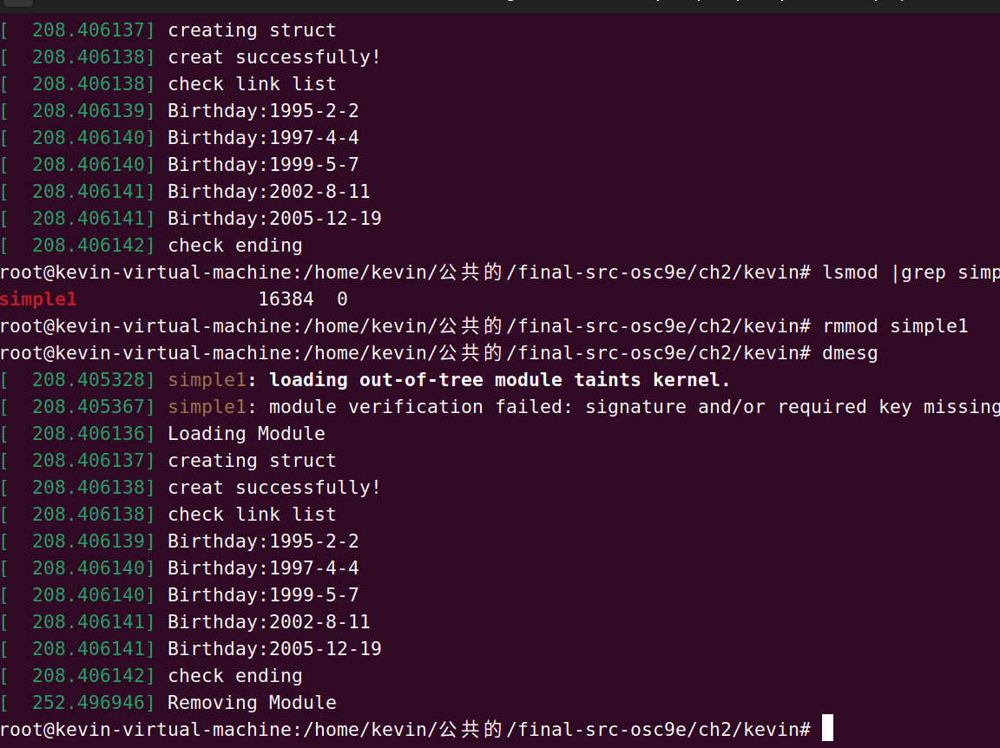

## 四、生成任务列表的Linux内核模块

### 第一部分


上面是对应的变量名

一开始遇到了下面的问题，在网上查资料发现需要include\<linux/sched/signal.h\>才可以


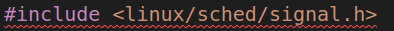

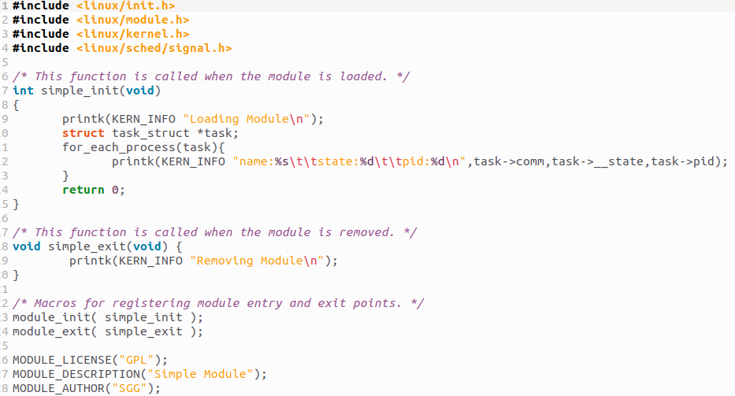

最后运行效果（这里因为太多了，只截取了一部分）：

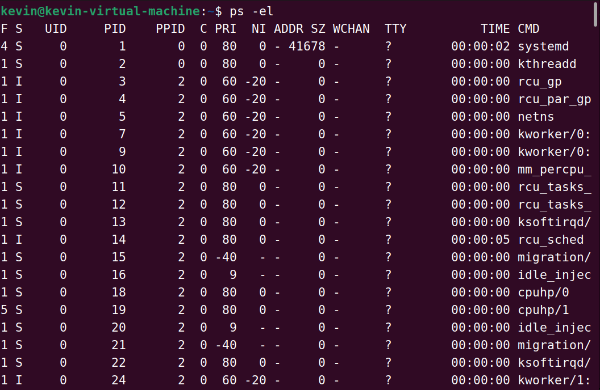

可以看到，都是一一对应的。

### 第二部分

第二部分与第一部分差不多，按照书上的指导来写代码就行

代码：

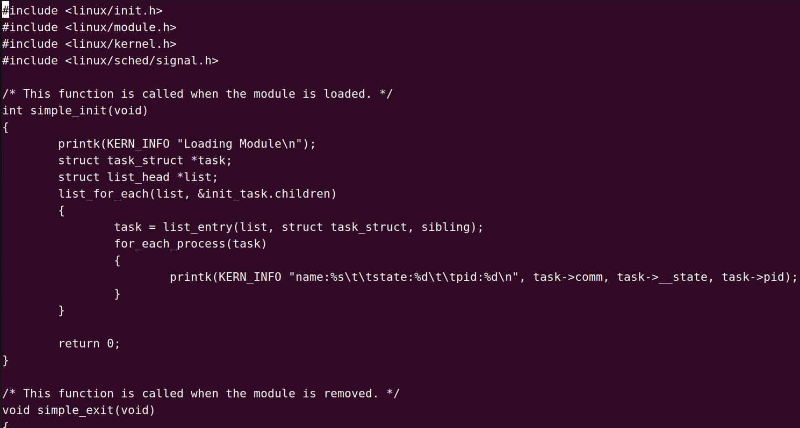


运行效果：

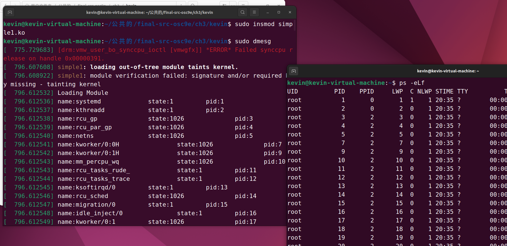


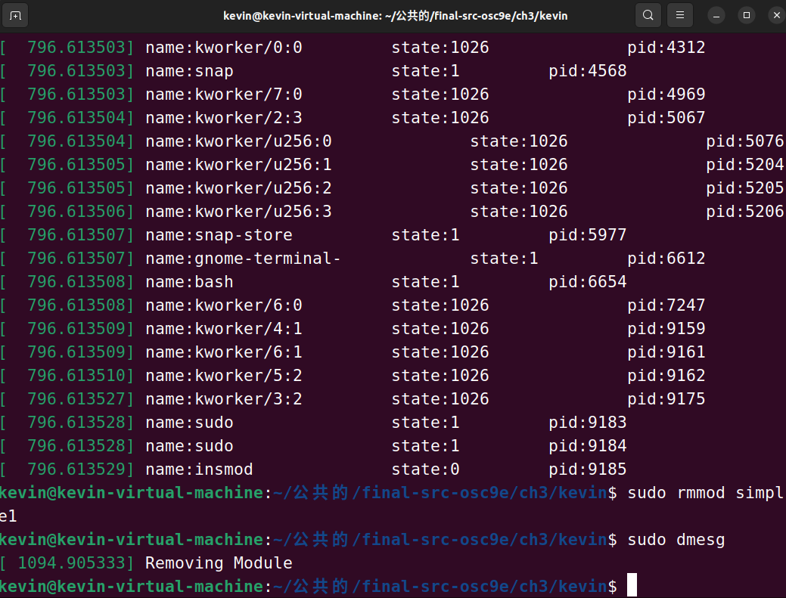

## （选作）实现UNIX外壳项目---可加2分

### 创建子进程，实现运行命令

首先要实现的是读取一行字符串，然后按照空格分隔出来，把每一个存入到args中，在这部分，我使用了ges和strtok函数来实现。


在调试的过程中，出现了一个很严重的问题，就是我一旦运行程序，电脑的cpu就会占满，一开始以为是虚拟机的问题，在网上试了很多方法都没有用，最后我查看进程发现系统在不停创建进程。下面红线部分是后来才加上的，如果不加，子进程呈指数性增加。

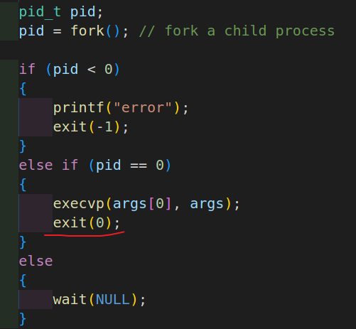

最后可以简单的实现命令和退出（exit）


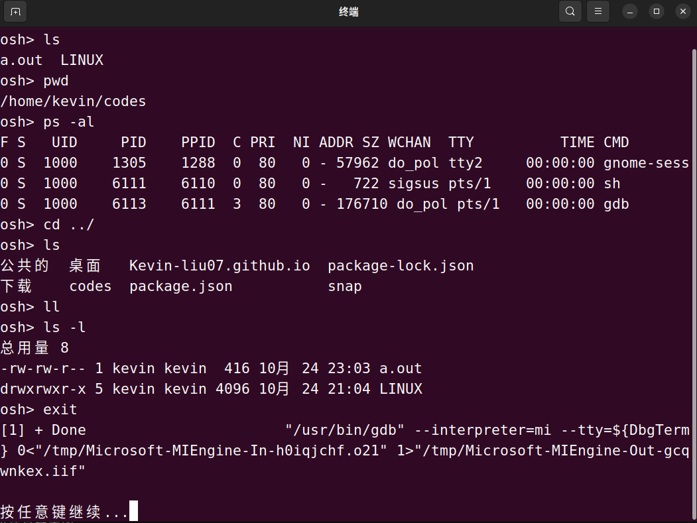

但是我在使用 & 命令时又报错了


我想着可能时子进程执行时不需要“&”，所以又有了下面的改进

先用last获取最后一个字符串，然后判断最后一个是不是“&”，若是的话，置为NULL，这样子进程就不会执行&。


然后父进程判断最后一个是不是“&”，不是的话就wait，是的话就不等待，直接进入下一次循环


可以看到，执行“ls”时正常输出，执行“ls &”时父进程先打印出“osh\>”，子进程才执行“ps”。

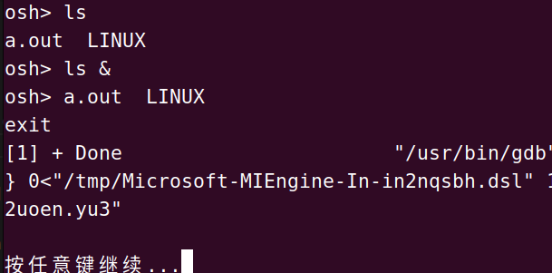

可以看到，我们在终端执行时也是这个效果。


### 实现history

在这部分，我是使用一个队列来实现保存history，下面的代码是只实现了输出history的功能。画线部分是新增的代码段

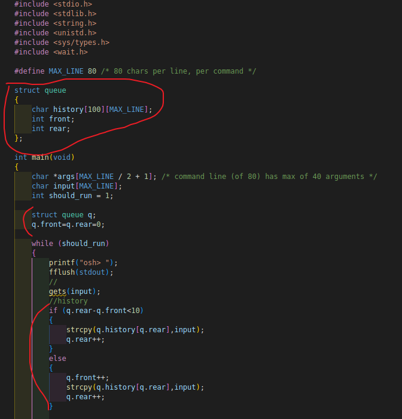

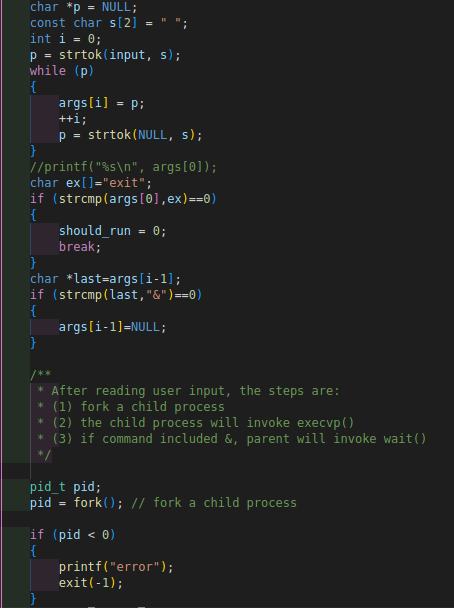


效果如图:


在这一部分中出现了一个问题，就是最后的历史输出每一个都是最后一次的命令。

我第一次输入的ps，第二次输入ls，可以看到，第二次输入后，第一次的也变成了ls


查看代码发现这一部分出了问题，按下图的写法，是将history的地址等于input的地址，所以input改变时，history也会改变。

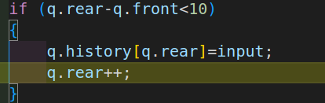

最后再来实现“！！”和“！”+数字 功能（！！和！2不会被记录到历史中）

只添加了这一部分代码就可以解决


运行效果如下：


